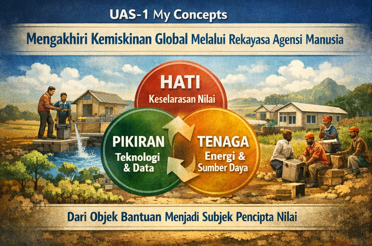

# UAS-1 My Concepts (ㅅ´ ˘ `)
**Mahakarya Kemanusiaan: Mengorkestrasi TISE untuk Nol Kemiskinan**

{width=950%}

Konsep saya tentang pengentasan kemiskinan global tidak berangkat dari pendekatan karitatif, melainkan dari rekayasa sistem yang memulihkan agensi manusia. Kemiskinan ekstrem yang dialami sekitar 700 juta penduduk dunia bukan sekadar kegagalan ekonomi, tetapi kegagalan sistem global dalam menyelaraskan nilai, pengetahuan, dan kerja manusia. Masalah utamanya adalah ketimpangan akses terhadap sistem penciptaan nilai.

Saya memandang kemiskinan sebagai krisis koordinasi global. Individu miskin tidak kekurangan potensi, mereka terputus dari sistem yang memungkinkan potensi itu bernilai. Kemiskinan global bukan sekadar masalah kelangkaan sumber daya, melainkan kegagalan sistemik dalam menyelaraskan kecerdasan kolektif kita. Oleh karena itu, Mahakarya Rekayasa untuk kemiskinan harus membangun ekosistem yang menyatukan Hati, Pikiran, dan Tenaga dalam satu arsitektur pemberdayaan. Untuk mewujudkan SDG 1 (Tanpa Kemiskinan) sebagai sebuah "Mahakarya", kita harus menerapkan arsitektur Triune Intelligence (TISE) pada skala makro:

* **Hati (Homocordium - Axiological Intelligence):** Hati adalah kecerdasan nilai kolektif. Dalam konteks kemiskinan, “Hati” berarti pengakuan martabat manusia miskin sebagai aktor utama, bukan objek belas kasihan. Tanpa keselarasan nilai ini, kebijakan dan teknologi hanya menjadi instrumen dingin yang gagal menyentuh akar masalah. Komunikasi publik dan partisipasi komunitas menjadi mekanisme utama untuk menyelaraskan kecerdasan hati, sehingga solusi yang dirancang benar-benar menjawab kebutuhan riil di lapangan.

Ini adalah fondasi moral pengentasan kemiskinan. Kita harus mengubah narasi dari "memberi sedekah" menjadi "memulihkan martabat". Homocordium global harus bergetar pada frekuensi yang sama: bahwa kemiskinan di Sub-Sahara Afrika adalah luka pada tubuh kemanusiaan kolektif. Tanpa "Hati" yang terkalibrasi, bantuan kemanusiaan hanya menjadi transaksi logistik tanpa empati yang mendalam.

* **Pikiran (Homodeus - Synergistic Practical Intelligence/PI-A):** Pikiran adalah kecerdasan rekayasa dan kecerdasan buatan. Di sinilah data kemiskinan, seperti ambang USD 2,15 per hari, diolah menjadi peta masalah yang presisi. AI berperan sebagai penguat daya pikir manusia. AI memetakan pola kerentanan, rantai pasok yang timpang, dan peluang ekonomi lokal. Namun, AI tidak mengambil keputusan moral. Manusia tetap menjadi pengarah utama yang menentukan prioritas dan tujuan sosial.

AI dan teknologi data bukanlah solusi ajaib, tetapi "Juru Tulis Cerdas" bagi para pembuat kebijakan dan NGO. Kita menggunakan Homodeus untuk memetakan kantong kemiskinan ekstrem secara real-time, memprediksi krisis pangan sebelum terjadi, dan mengoptimalkan rantai pasok bantuan. Namun, manusialah yang memegang kendali decision making untuk memastikan algoritma tidak bias terhadap kelompok rentan.

* **Tenaga (Natural Intelligence - Human & Environmental Energon):** Tenaga adalah energi kerja manusia dan sumber daya alam. Dalam kemiskinan ekstrem, tenaga manusia sering terbuang karena tidak terhubung ke sistem produktif. TISE mengelola tenaga ini melalui pendekatan PSKVE, sehingga waktu, keterampilan, dan sumber daya lokal dapat dikonversi menjadi produk, layanan, dan nilai ekonomi yang berkelanjutan. Tujuannya adalah memastikan setiap intervensi meningkatkan kapasitas jangka panjang, bukan sekadar konsumsi sementara.

700 juta orang yang hidup dalam kemiskinan bukanlah beban, melainkan cadangan Human Energon yang belum teraktualisasi. Mahakarya ini terjadi ketika kita menyuplai CORE Engine mereka dengan akses (kesehatan, pendidikan), sehingga mereka dapat mengubah Time & Effort mereka menjadi nilai ekonomi (PSKVE) yang berkelanjutan, tanpa merusak Environmental Energon.

Dengan demikian, Mahakarya Rekayasa untuk kemiskinan global bukanlah program bantuan berskala besar, melainkan platform sistemik yang menghubungkan jutaan komunitas miskin ke dalam jaringan ko-kreasi nilai global. Platform ini memungkinkan setiap individu menjadi Protagonis-Penulis atas kehidupannya sendiri, dengan dukungan sistem yang adil, cerdas, dan berkelanjutan.