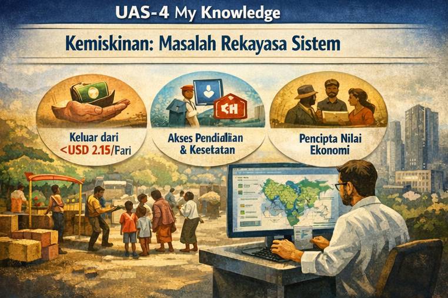

# UAS-4 My Knowledge
**Pengetahuan Baru tentang Kemiskinan sebagai Masalah Rekayasa Sistem**

{width=950%}

Mahakarya ini menghasilkan pengetahuan baru bahwa kemiskinan ekstrem adalah kegagalan desain sistem sosial, bukan kegagalan individu. Pengetahuan ini menuntut perubahan indikator keberhasilan. Keberhasilan tidak lagi diukur dari jumlah bantuan yang disalurkan, tetapi dari peningkatan agensi manusia.

Indikator utamanya adalah kemampuan individu keluar secara stabil dari ambang USD 2,15 per hari, akses berkelanjutan terhadap pendidikan dan kesehatan, serta keterlibatan aktif dalam sistem ekonomi lokal. Dengan pendekatan ini, kemiskinan dipahami sebagai tantangan rekayasa yang dapat dirancang, diuji, dan diperbaiki.

Mahakarya ini menegaskan satu hal. Jika rekayasa sistem mampu menyelaraskan hati manusia, pikiran teknologi, dan tenaga kolektif, maka kemiskinan ekstrem bukan takdir, melainkan masalah yang dapat diselesaikan.