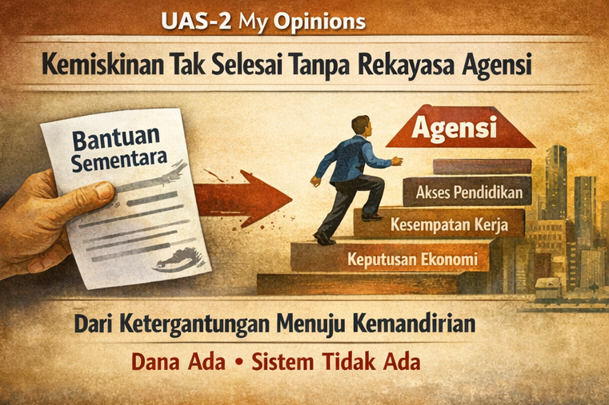

# UAS-2 My Opinions ٩(ˊᗜˋ )و
**Opini Berpengaruh tentang Kemiskinan Global**

{width=950%}

Pengentasan kemiskinan global selama puluhan tahun gagal karena fokus pada distribusi, bukan pemberdayaan. Bantuan pangan, subsidi tunai, dan hibah darurat memang menyelamatkan nyawa, tetapi tidak mengubah posisi struktural masyarakat miskin dalam sistem ekonomi. Fakta bahwa kemiskinan ekstrem meningkat kembali pasca pandemi COVID-19 menjadi bukti nyata rapuhnya pendekatan lama.

Pendidikan, teknologi, dan kebijakan publik harus berhenti memposisikan masyarakat miskin sebagai penerima. Mereka harus ditempatkan sebagai pencipta nilai. Inilah pergeseran mental yang wajib dilakukan jika Sustainable Development Goal 1 ingin tercapai secara nyata.

Opini saya tegas. Kemiskinan tidak dapat diselesaikan tanpa rekayasa agensi. Selama orang miskin tidak memiliki kendali atas keputusan ekonomi, pendidikan, dan kerja mereka, kemiskinan akan terus diwariskan. Dunia saat ini tidak kekurangan dana, teknologi, atau pengetahuan. Dunia kekurangan sistem yang menyatukan ketiganya dalam satu kerangka tujuan kemanusiaan. Oleh karena itu, kta harus melakukan transformasi radikal dalam cara kita memandang "bantuan" bagi kaum miskin, serupa dengan pergeseran dari pembelajaran hafalan ke VALORAIZE Learning.

* **Kaum Miskin sebagai "Protagonis-Penulis":** Model bantuan konvensional sering kali menempatkan orang miskin sebagai objek pasif (seperti mahasiswa yang hanya menghafal jawaban). Kita harus mengubah mereka menjadi "Protagonis-Penulis" atas kisah hidup mereka sendiri. Mereka harus memiliki agensi untuk menentukan jalan keluar dari kemiskinan, bukan sekadar menerima paket bantuan standar.

* **Ko-Kreasi Nilai di "Pasar Kehidupan":** Program pengentasan kemiskinan harus dirancang sebagai simulasi Knowledge Marketplace. Bantuan tidak diberikan cuma-cuma (yang menciptakan ketergantungan), tetapi dipertukarkan dengan "Artefak Nilai" yang mereka ciptakan.
> **Contoh:** Petani miskin tidak hanya diberi uang, tetapi diberikan modal untuk menghasilkan "Peta Pertanian" (rencana tanam) atau produk lokal yang kemudian "dibeli" oleh pasar global atau pemerintah dengan harga yang adil (mata uang fiat) atau akses layanan (mata uang poin/sosial).

* **Portofolio Kemandirian:** Keberhasilan program tidak diukur dari berapa dana yang disalurkan (ujian sesaat), tetapi dari Portofolio Kekayaan yang dibangun keluarga tersebut dari waktu ke waktu — akumulasi aset, keterampilan, dan kesehatan yang membuktikan mereka telah lulus dari ambang batas USD 2,15 per hari.